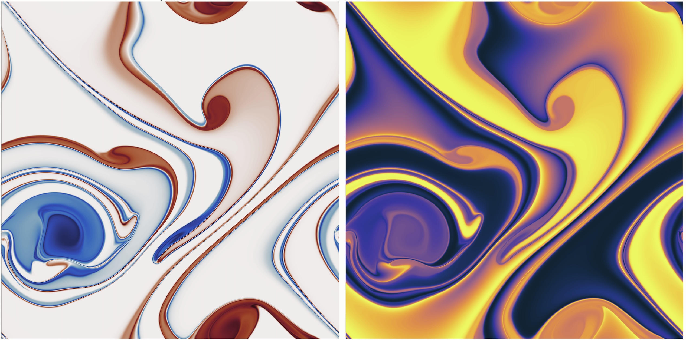

# GeophysicalDissipation.jl

Validation and testing of dissipative continuous and numerical approximations for geophysical flows.

Some slides: https://docs.google.com/presentation/d/1Vfu3KYTvz5GD12X_4dJPKFN_6IMJIdnir3KWWzifmag/edit?usp=sharing

Visualization of vorticity and a passive dye from a "inviscid" two-dimemsional simulation: 

